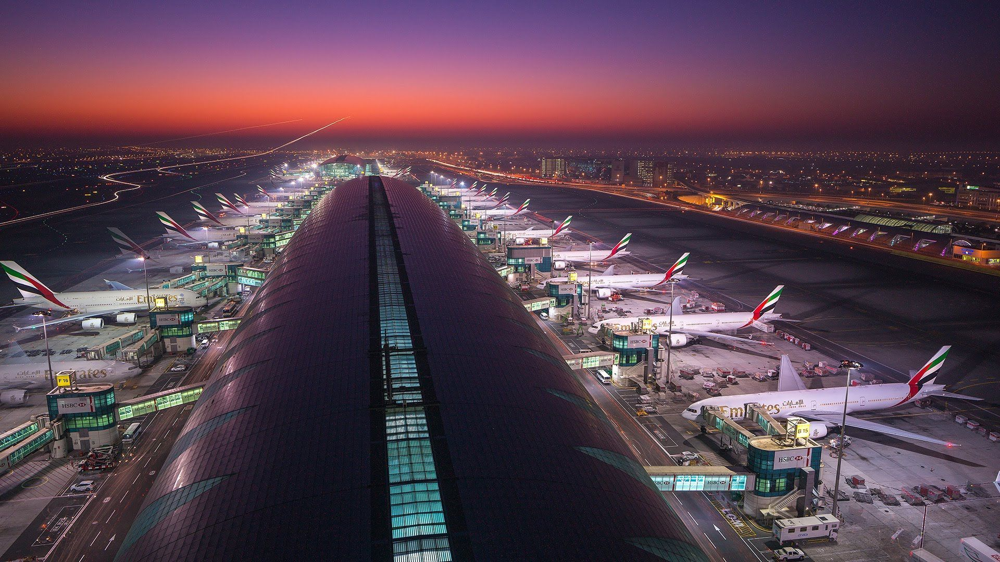

<!DOCTYPE html>
<html lang="en">
<head>
    <meta charset="UTF-8">
    <meta name="viewport" content="width=device-width, initial-scale=1.0">
    <title>Airport Management</title>
    <link rel="stylesheet" href="styles.css">
    
</head>
<body>
    <nav class="navbar">
        <ul>
            <li><a href="#home">Home</a></li>
            <li><a href="#flights">Flights</a></li>
            <li><a href="#services">Services</a></li>
            <li><a href="#contact">Contact</a></li>
        </ul>
    </nav>

    <header class="header">
        <h1>Welcome to Airport Management Portal</h1>
        
Streamlining Airport Operations with Efficiency

    </header>

    <section class="content">
        <h3>Airport View</h3>
        

        <h2>Flight Schedule</h2>
        <table class="data-table">
            <tr>
                <th>Flight</th>
                <th>Destination</th>
                <th>Departure</th>
                <th>Status</th>
            </tr>
            <tr>
                <td>AI-101</td>
                <td>New York</td>
                <td>10:30 AM</td>
                <td>On Time</td>
            </tr>
            <tr>
                <td>BA-204</td>
                <td>London</td>
                <td>11:15 AM</td>
                <td>Delayed</td>
            </tr>
        </table>
    </section>

    <footer class="footer">
        
© 2025 Airport Management. All Rights Reserved.

        

            <a href="https://twitter.com" style="color: white; text-decoration: none;">Twitter</a> |
            <a href="https://facebook.com" style="color: white; text-decoration: none;">Facebook</a>
        

    </footer>
</body>
</html>
